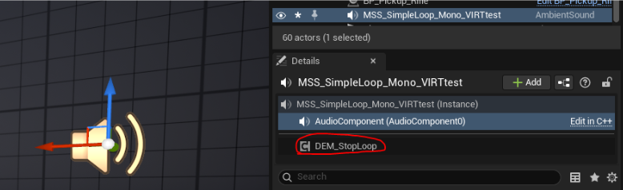
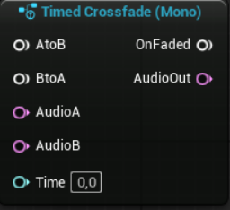

## Introduction
As Dan Reynolds, the father of Metasounds, said: “*Metasounds are not just an implementation environment, they're a **design environment**.*” Yet in game audio, most implementation follows a handful of common designs. This pack provides professionally crafted presets for those designs, along with useful patches and a runtime debugging tool for faster, easier implementation.
## How to Install
Make sure your Unreal project is version **5.5** or above. In the root folder of your project, create a plugins folder if it doesn’t already exist. Drag the `Demute_Metasound_PresetsAndPatches` folder into that new plugins folder. Then activate the plugin in edit > plugins.

## How to Use
### Source Graphs & Patches
The metasounds in the ***source graphs*** folder and the ***patches*** folder contain audio logic to use as nodes. To use them in your own metasound just search for their name (use the versions without prefixes).

##### Containers
The amount of logic in the source graphs may be quite overwhelming so in the ***containers*** folder you can find simpler looking versions of the logic (that just use the source graph as nodes). Instead of creating new metasounds, you can simply duplicate one of these containers to use as your new baseline.

The containers contain all the same inputs as the corresponding source graphs but some of these inputs are not connected to the node for easier manual editing. 

Take for example the simple loop node. More often than not you will set the looping wave asset and not be changing it at runtime. Therefore the Wave Asset input is disconnected (and moved to the top left of the graph) so that you simply set the asset in the node (this feels more intuitive than changing it in the input list on the side of the screen). 
The same logic applies to the `Ignore Random Start Time` boolean value, this should be something that is “set and forget”. However it is an advanced pin and doesn’t show up on the node by default, to see it you must click on the arrow at the bottom of the node. 
All unconnected inputs are put away at the top left of the graph so you can see at a glance which ones are not controlled via inputs.
Float inputs are kept connected as they give us access to nice little dials to change values with. If the value you would like to set exceeds (or is less than) the max/min of the wheel, you can increase these values in the input editor (click on the input > Default Editor Options > Range).
## Stopping Loops
The [containers](#Containers) containing looping metasound sources (not the sources themselves) do not have the `OneShot` interface, this allows them to virtualize when a player steps out of their attenuation range. This means that they do not have an `OnFinished` node and thus are not automatically grabbed up by garbage collection when they are done.

To allow them to be collected by garbage collection when needed, these metasounds must be stopped with the `Fade Out` & `Stop` blueprint nodes.
The following containers need to be stopped in this way (if you want them to be destroyed) : 
- [Simple Loop](#Simple Loop)
- [Random Loop](#Random Loop)
- [FlipFlop](#FlipFlop)
- [State Loops](#State Loops)
- [Shuffle Playlist](#Shuffle Playlist)
##### Advanced Loop & Scatterer
The [Advanced Loop](#Advanced Loop) & the [Scatterer](#Scatterer) both need to run custom metasound logic when stopping, this means that we cannot use the same blueprint nodes as the others. However they cannot be one-shots either ; they wouldn’t be able to virtualize.
If you want them destroyed when stopped, you must place the actor component `DEM_StopLoop` found in the ***ActorComponent*** folder on the actor with the sound component.

To stop the loops, execute the corresponding trigger parameter for each container (see the container’s triggers), and the metasound logic will activate. When that logic is done, the `StopLoop` actor component will correctly stop the playback, allowing it to be picked up by garbage collection.

## Debugging
In the ***ActorComponent*** folder there is an actor component that can help you debug your metasounds called `DEM_MetasoundDebuggingTool`. When you place this on an actor with a sound component, it will display the name of the wave file playing in the metasound, as well as the playtime and the full duration of the wave file.

Additionally, important actions within the metasound will also be displayed ; such as changing states, starting a crossfade, etc…
Each [Included Preset](#Included Presets) has a list of event update logs that they can display.

The debugging tool has the following options : 

**Show File Path?** - Toggle to show the complete wave asset path on top of just the file name for the playing wave asset.
**Text Color** - Changes the display color of the debug text.
**Multiple Component Index** - If the debug tool is placed on an actor with multiple audio components, choose which component to debug display (0 being the first one). To have multiple audio components on the same actor be debuggable at the same time, you will need to change the way the tool manages display keys.
##### Using with your own Metasounds
To make your own metasounds compatible with this debugging tool, you need to make sure they have five outputs named according to this list : 
- `Event Update` (string) - in which you log the important actions
- `Playing Wave File` (string) - for the playing file’s name
- `Playing Wave Path` (string) - for the playing file’s path (optional)
- `Playback Time` (time) - the playback time
- `Wave File Duration` (time) - the wave file’s duration

Here is how to hook up the outputs for simpler metasounds.
Playback time is just hooked up to the wave player output of the same name.

Things become more complicated when routing information from multiple wave players and randomly selected wave assets. 
Look into the Debug Patches folder for tools to help you route the information.
## Included Presets
*Every preset and patch made to be used as nodes all have tooltips for their inputs & outputs. Hold your mouse over them for more information.*
##### Simple One Shot
*Comes in both Mono & Stereo.*

Plays a simple one shot with pitch shifting and debugging outputs.

**List of Event Update Message**
- `Playback Started`
- `Playback Finished`
##### Random One Shot
*Comes in both Mono & Stereo.*

Plays a one shot randomly selected with optional pitch shifting and debugging outputs.

**List of Event Update Message**
- `Playback Started`
- `Playback Finished`
##### Simple Loop
*Comes in both Mono & Stereo.*

Loops a sound with a random start time, fades in/out, and debugging outputs

**List of Event Update Message**
- `Playback Started`
- `Playback Finished` ([not for containers](#Stopping Loops))
- `Fade In Completed`
- `Fade Out Started` ([not for containers](#Stopping Loops))
##### Random Loop
*Comes in both Mono & Stereo.*

Loops a single asset randomly chosen from a list of assets with a random start time, fades in/out and debugging outputs.

**List of Event Update Message**
- `Playback Started`
- `Playback Finished` ([not for containers](#Stopping Loops))
- `Fade In Completed`
- `Fade Out Started` ([not for containers](#Stopping Loops))
##### Switch
*Comes in both Mono & Stereo., with 8, 16, or 32 switch values.*

Play a random one-shot from one of 8/16/32 arrays driven by the Switch Value input, each individual switch acts like a [Random One Shot](#Random One Shot).

**List of Event Update Message**
- `Playback Started`
- `Playback Finished`
- `Switch Index Out Of Bounds`
##### FlipFlop
*Comes in both Mono & Stereo.*

Crossfades between two different loops on command.

**List of Event Update Message**
- `Playback Started`
- `Playback Finished` ([not for containers](#Stopping Loops))
- `Fade In Completed`
- `Fade Out Started` ([not for containers](#Stopping Loops))
- `Crossfade Started`
- `Crossfade Completed`
##### State Loops
*Comes in both Mono & Stereo.*

Plays a loop driven by a state value, on value change will crossfade into the corresponding version of the loop.

**List of Event Update Message**
- `Playback Started`
- `Playback Finished` ([not for containers](#Stopping Loops))
- `Fade In Completed`
- `Fade Out Started` ([not for containers](#Stopping Loops))
- `Crossfade Started`
- `Crossfade Completed`
- `State Change`
##### Shuffle Playlist
*Comes in both Mono & Stereo.*

Plays through a playlist of audio assets on shuffle with crossfades.

**List of Event Update Message**
- `Playback Started`
- `Playback Finished` ([not for containers](#Stopping Loops))
- `Fade In Completed`
- `Fade Out Started` ([not for containers](#Stopping Loops))
- `Crossfade Started`
- `Crossfade Completed`
- `Starting Next Track`
##### Advanced Loop
*Comes in both Mono & Stereo.*

Loops a wave asset with a startup one-shot and a shutdown one-shot. [Garbage Collection Notice](#Advanced Loop & Scatterer).

**List of Event Update Message**
- `Playback Started`
- `Playback Finished`
- `Startup Completed`
- `Shutdown Started`
##### Scatterer
*Spatializes Mono Assets to Stereo Output.*

Scatters up to 8 one-shots simultaneously (random distance, pan & pitch). [Garbage Collection Notice](#Advanced Loop & Scatterer).

**List of Event Update Message**
- `Playback Started`
- `Playback Finished`
- `Scatterer Turned Off`
## Included Patches
##### Get Pitch Shift

Generates a random float value between -`Pitch Variation` and +`Pitch Variation` to be used as a pitch shifting input for a wave player.
##### Random Start Time

Selects a random start time for a wav file using the file's length as the upper bounds of the selection.
##### Modular Start Time

Generates a random start time or returns start of the file if set to ignore.
##### Timed Crossfade

Allows for linear crossfading between two audio streams depending on an input crossfade length (time) in seconds.
##### Trigger Select Overflow

A `Trigger Select` node that returns overflow values and triggers instead of ignoring them. The returned `Overflow` value is `Index - 8` to be plugged into the next `Trigger Select` in the chain.
##### Scatter Mono Asset

Scatters a single mono asset (random distance, pan and pitch). Used in the [Scatterer](#Scatterer) source graph.
##### Debug Patches
This small collection of patches are used to route string and wave values for [debugging](#Debugging) purposes.
## Credits & Licensing
- Created by [Demute](https://www.demute.studio/).
- Free for personal and commercial use in your projects.
- Please do not resell the pack.
- Attribution is appreciated but not required.
